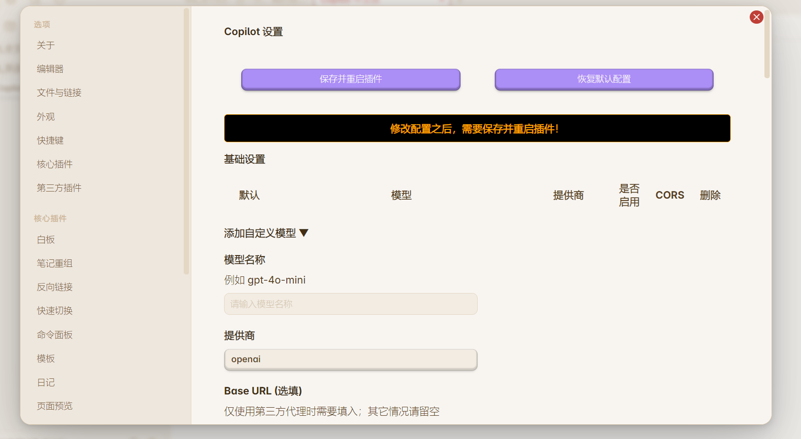
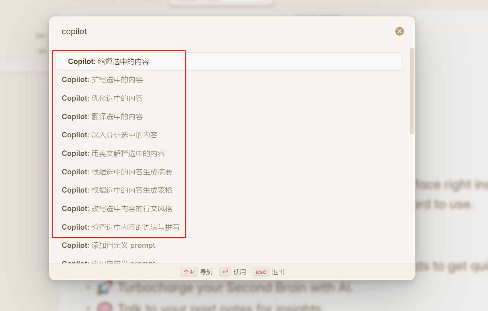

# 🔍 Copilot 中文版

众所周知，Copilot 这个插件可以给Obsidian添加AI功能，

但原开发是基于英文笔记书写习惯的，设置的内置命令也很拉胯，

因此我基于该插件的 `v2.6.6版本` ，修改了插件，将显示和快捷命令设置成中文，

同时修改了内置的prompt，并且去除了平时用不上的配置。

## 主要优化

**设置项为中文界面**

**快捷命令**，去除原插件中不好用的prompt，重新设置了如下prompt：

- 检查选中内容的语法与拼写（方便英语学习）
- 根据选中的内容生成摘要
- 根据选中的内容生成表格
- 从选中的内容里提取重难点单词（方便英语学习）
- 深入分析选中的内容
- 智能分段（仅分段，不会修改原内容）
- 将选中的内容翻译成英文并给出解释（方便英语学习）
- 将选中的内容翻译成英文并给出解释（方便英语学习）
- 从选中的内容里获取关键词作为标签
- 缩短选中内容
- 扩写选中内容
- 优化选中的内容（修改错别字+标点符号+智能分段）
- 用英文解释选中的内容（方便英语学习）
- 翻译选中的内容（有多个选项）
- 改写选中内容的风格（有多个选项）

**聊天面板**

---

如果你不了解copilot这款Obsidian插件，可以到原作者仓库下查看 -> [原Copilot插件仓库](https://github.com/logancyang/obsidian-copilot)

Obsidian 的 Copilot 是一个 **免费** 且 **开源** 的 LLM 接口，直接内置于 Obsidian 中。它设计简洁，使用方便。

- 💬 在 Obsidian 中使用 ChatGPT UI。
- 🛠️ 使用 Copilot 命令通过你的写作提示 AI 以获得快速结果。
- 🚀 用 AI 加速你的第二大脑。
- 🧠 与过去的笔记对话以获取洞察。

目标是让这个 AI 助手 **本地优先** 和 **隐私导向**。它有一个 **本地** 向量存储，并且可以与 **本地** 模型一起工作，用于聊天和问答 **完全离线**！更多功能正在建设中。敬请期待！

## 🙏 Thank You

如果这个插件改造对您有用，可以给我点一个 star~

如果需要联系我，可到公众号【思维兵工厂】

